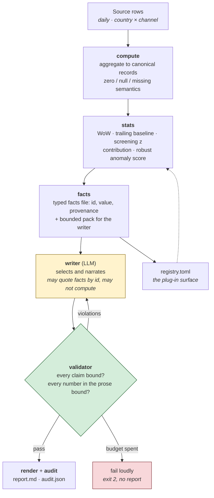

# Veritas

**Every number in the report is bound to a deterministically computed fact. The
language model writes the prose; it never writes the facts.**

Veritas generates a weekly business report. A deterministic pipeline computes
every metric, every comparison and every screening statistic, and decides
nothing. A language model reads those pre-computed numbers, decides what is
worth reporting, and writes it up. Then a deterministic validator takes the
model's draft apart and checks that every number in it binds to a fact the
pipeline actually computed — right metric, right segment, right period, right
value. A number that does not bind is a hard failure: the draft goes back to the
writer with the violations, and after the retry budget the run fails loudly and
writes no report.

The output is a readable report plus a machine-readable audit trail: claim →
fact id → the computation that produced it.

```
$ make demo
facts     6,731 computed, 820 in pack
writer    mock / deterministic-mock-writer-1, 1 attempt(s)
validator 23 claim(s) bound, 0 violations
report    out/report.md
audit     out/audit.json
```

No API key needed for any of that — see [Running it](#running-it).

---

## Why

An LLM asked to summarise a metrics table will produce a fluent report
containing numbers that are *approximately* right, and there is no reliable way
to tell by reading which ones. Prompting ("only use figures from the table") is
a request, not a control.

Veritas takes the arithmetic away from the model entirely and then verifies what
it wrote. The model keeps the job it is genuinely good at — deciding that a
channel going to zero matters more than a 1.6% move with a large z-score, and
saying so in a sentence a person wants to read.

## Architecture



The yellow box is the only part that is not deterministic. The green box is what
makes that acceptable.

### The trust boundary, concretely

The writer returns structured highlights, each carrying a `claims` array. The
validator then applies, in order:

| Rule | What fails it |
| --- | --- |
| **Structure** | The response does not parse, or a highlight is missing a field |
| **Bound claims** | A `fact_id` that does not exist in this run, or exists but was never shown to the writer, or whose computed value disagrees with the claim beyond the metric's display tolerance |
| **Subject and period** | A claim about a different metric or segment than the highlight is headed with, or a highlight anchored only in baseline weeks — a correct figure from the wrong series is still a lie about what it measures |
| **Narrative consistency** | A numeric token that is not the **published** rendering of a cited fact: not its `display` string digit for digit, or not in its unit. Binding on the underlying value would let `$1,234,567.4` through, or any figure inside the tolerance band; binding without the unit would print a percentage-point delta as a percentage |
| **Stray numerals** | Anything numeric the scanner did not read as a quotable number — the exponent in `1.2e6`, a mis-grouped `-10,0%` (which is a tenfold error, not a rounding), a digit glued to a word, a vulgar fraction |
| **Words as quantities** | "roughly halved", "almost two million", "about a third" — a magnitude with no figure behind it |
| **Causal labelling** | Causal language outside the `hypothesis` field, participles included ("driving", "triggered by", "reflects") |
| **Render safety** | HTML, script fragments, links including bare hostnames, and block-level markdown — a narrative opening with `## ` would forge a heading at the report's own level |
| **Field binding** | A `metric_id` outside the registry, a `cut` naming a segment the writer was never shown, a `severity` outside its enum, a dismissal of a candidate never offered, or a `narrative` that is not a string — all of these are printed, so all of them are checked |

Every one of these has an adversarial test. From `tests/test_validator.py`:

```python
def test_prose_is_checked_against_the_computed_value_not_the_claim(self):
    # The claim faithfully repeats a fabricated figure. Binding against the
    # claimed value would wave this through; binding against the fact does not.
    text = response([highlight(
        narrative="GMV for overall came in at $2,000,000.",
        claims=[{"fact_id": VALUE_FACT, "value": 2_000_000.0}],
    )])
    codes = self.codes(text)
    self.assertIn(E_VALUE_MISMATCH, codes)
    self.assertIn(E_UNBOUND_NUMBER, codes)
```

### What a fact is

```json
"gmv/channel=display_ads/complete_week:2026-08-08/wow_pct": {
  "value": -100.0,
  "display": "-100.0%",
  "unit": "percent",
  "display_precision": 1,
  "provenance": {
    "computation": "wow_pct",
    "formula": "100 * (current - prior_week) / |prior_week|",
    "inputs": [
      "gmv/channel=display_ads/complete_week:2026-08-08/value",
      "gmv/channel=display_ads/complete_week:2026-08-01/value"
    ]
  },
  "flags": []
}
```

Facts reference facts, so the audit trail can walk any published number back
toward the source rows. The writer sees a compact projection — id, label, value,
display string, flags — and never the derivations.

## Running it

Python 3.11 or newer. No dependencies, no API key, no network.

```bash
git clone <this repo> && cd veritas-report
make demo          # generate data -> compute -> write -> validate -> report
make test          # 222 tests, standard library only
cat out/report.md
```

To write with a real model instead of the deterministic mock:

```bash
pip install -e '.[anthropic]'
export ANTHROPIC_API_KEY=...            # read from the environment, never stored
python -m veritas run --provider anthropic --model claude-opus-5
```

The validator is identical on both paths. That is the point: swapping in a real
model changes the prose, not the guarantees.

Other commands:

```bash
python -m veritas generate --seed 20260813    # dataset only
python -m veritas run --as-of 2026-08-13      # report over existing data
make samples                                  # refresh samples/
```

Exit codes: `0` clean, `1` unusable input, `2` validation failed (no report
written; the audit trail is), `3` run incomplete (report written, with a banner).

## The demonstration data

`veritas/generate.py` writes 18 months of daily storefront data — sessions,
orders and GMV by country and channel — from a seed, so the same file appears on
every machine. It carries a growth trend, weekday and annual seasonality, a
market-wide daily shock and per-cell noise, plus six planted events:

| Planted | What should surface |
| --- | --- |
| `display_ads` switched off from 2026-08-02 | A disappeared segment: zero-filled, flagged, and reported ahead of any statistical move |
| `marketplace` launched 2026-08-02 | A new segment with **no baseline at all** — no z-score exists for it, and it is still the story |
| Germany's paid-search conversion drops ~35% | A sustained week-over-week fall, visible at both the country and channel cuts |
| Japan spikes ~2.3x on 2026-08-05 only | A single-day anomaly against a same-weekday baseline |
| US affiliate order value collapses ~45% | A week-long move with a large contribution to the overall change |
| Email sessions ramp ~40% over six weeks | A trend that should *not* read as a spike |

Nothing downstream knows the events exist, so they double as an end-to-end check
on the statistics layer. `tests/test_facts.py` asserts the shutdown and the
launch reach the shortlist through the channels that exist for them.

## The statistics

All in `veritas/stats.py`, all pure functions, all unit-tested against
hand-computed values.

* **Week over week** — complete Sunday-to-Saturday weeks. The current day is
  never included. A partial week is compared only against the *same elapsed
  slice* of earlier weeks, never against a full one.
* **Trailing baseline** — mean and sample standard deviation of the prior four
  complete weeks, and a `screening_z` against it.
* **Contribution to change** — each segment's share of the overall
  week-over-week change. **Additive statistics only**: a mean or a percentile
  does not roll up, and the code refuses to pretend it does.
* **Robust anomaly score** — each day against its eight most recent *same
  weekdays*, on median and MAD. A trailing 28-day window would flag every
  structurally different weekday; a mean and standard deviation would let one
  earlier outlier mask this week's spike. The MAD is rescaled to a
  standard-deviation equivalent, and floored — `sqrt(max(median, 1))` for counts,
  `0.01 × |median|` for continuous metrics — as `max(observed, floor)`, never as
  a substitution. A floor may only push a scale *up*; replacing a genuinely wide
  scale with a smaller floor would manufacture a spike.
* **Degenerate cases are routed, not fudged.** An all-zero baseline with a
  non-zero current value is not scored at all — it goes to the new-segment
  channel, because a z-score of it would be meaningless. Rates carry adequacy
  flags on the actual validity condition (`n ≥ 30` **and** `min(k, n−k) ≥ 5`),
  not on a flat sample-size rule that waves through a 1% rate on n = 100.

Both scores are named for what they are. `screening_z` is a **ranking
heuristic** on four observations, not a calibrated p-value, and the report and
the audience brief say so — with dozens of metric-by-segment combinations, a
handful of extreme readings turn up every week by chance.

## Fail-closed behaviour

The pipeline is allowed to refuse. It is not allowed to guess.

* **Dirty input** — non-numeric, negative or non-finite measures, bad dates,
  duplicate cells, unexpected columns, or a label outside the allowed character
  vocabulary all stop the run before anything is computed.
* **Missing coverage** — the delivered day grid is checked against the days the
  report will speak about. A source ending one day early is caught even though
  every period still has rows, because the partial week would otherwise be
  compared against baselines a day longer than itself.
* **Stale data** — a source that does not reach the reporting window marks every
  metric stale rather than computing on what is there.
* **Zero, null and missing are three different things.** A quiet week is `0` and
  present. A rate with no traffic is `null` — never a fabricated 0%. A missing
  record is missing coverage. Segments that vanish are zero-filled *type-aware*
  and stamped `zero_fill`, which is what makes "this segment disappeared"
  decidable rather than inferred from absence.
* **A required metric that fails takes the run with it.** The report carries a
  banner, the coverage table lists what happened, and the exit code is non-zero.
  Optional metrics degrade to the coverage section.

## Adding a metric

Add an entry to `config/registry.toml`. No engine change — compute, statistics,
packing and validation are metric-agnostic.

```toml
[[metric]]
id = "refund_rate"
title = "Refund rate"
metric_type = "rate"
statistic = "rate"          # selects the statistics path and declares additivity
numerator_field = "refunds"
denominator_field = "orders"
unit = "percent"
display_precision = 2       # also sets the validator's tolerance
direction = "down_is_good"
required = false
cuts = ["country", "channel"]
```

## Repository layout

```
veritas/
  generate.py    seeded synthetic dataset with planted events
  registry.py    metric definitions: the plug-in surface
  periods.py     Sunday weeks, partial weeks, same-weekday baselines
  records.py     the canonical record contract; zero/null/missing semantics
  compute.py     source loading, validation, aggregation
  stats.py       every statistic, pure functions, no I/O
  facts.py       the typed facts file and the bounded pack
  writer.py      prompt construction and the output contract
  validator.py   the centerpiece: binds every published number to a fact
  render.py      markdown, with untrusted strings treated as text
  audit.py       claim -> fact id -> computation
  pipeline.py    orchestration, retry loop, failure policy
  llm/           provider interface, deterministic mock, Anthropic client
config/          registry.toml, audience_brief.md
samples/         a checked-in report and its audit trail
tests/           222 tests
```

## Sample output

[`samples/report.md`](samples/report.md) and
[`samples/audit.json`](samples/audit.json) are a real run, checked in. Every
number in the report appears in the audit trail with the computation that
produced it and the tolerance it was checked against.

## Design notes

[`DECISIONS.md`](DECISIONS.md) records the choices, including the ones that were
wrong first — the four-observation MAD that made ordinary days look like
anomalies, the period-level coverage check that missed a truncated partial week,
and the adequacy rule that produced nonsense flags on a mean.

## License

MIT.
